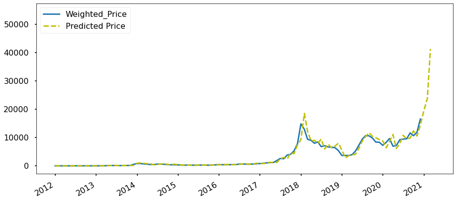

## 3. Trend Based On AI
我们希望借助机器学习和深度学习来预测加密硬币的价格。为了简化我们的任务，我们选择BTC作为我们的试点，然后选择ETH。我们的目标是预测未来十大加密币的价格。我们利用混合机器学习技术、公众情绪和监管政策建立了一个**时间序列预测密码币价格的理论**

### 3.1 机器学习
在进行时间序列预测时，人们通常只利用历史数据对变量进行预测。传统的时间序列预测模型如自回归综合移动平均（ARIMA）更适合于单变量和平稳的时间序列数据。但BTC价格具有高度的波动性、非线性和非平稳性。由于其快速变化的性质，我们需要添加新的功能结合传统的机器学习模型来预测BTC的价格。

我们的目标是估计目标变量x在未来时间点的值𝑥̂ [𝑡+𝑠] = 𝑓(𝑥[𝑡],𝑥[𝑡−1],...,𝑥[𝑡−𝑛]),𝑠>0，s是预测的地平线。第一步，我们将重点放在开始时的短期预测上，这意味着我们将考虑每日收盘价预测，并将短期（日终和次日）的价格上涨/下跌预测作为预测的范围。我们的长期目标是预测7-30天。

至于机器学习算法，我们使用以下ML模型进行分类和回归：

- Fb prophet
- 支持向量机(SVM)
- 人工神经网络(ANN)
- 叠层人工神经网络(SANN)
- 长短期记忆(LSTM)

分类如下：如果BTC每日收盘价𝑃𝐵𝑇𝐶[𝑡+1]−𝑃𝐵𝑇𝐶[𝑡]≥0那么𝑦[𝑡]=+1，如果𝑃𝐵𝑇𝐶[𝑡+1]−𝑃𝐵𝑇𝐶[𝑡]<0，那么𝑦[𝑡]=0，其中y[t]是涨价和降价类别的目标变量。其中y[t]是涨价和降价类别的目标变量。回归模型用于预测BTC价格在一天结束和第二天的预测范围内，并将花费7-30天的长期计划。

对于这一部分，我们可以从Coinmarketcap、区块链信息等获取数据。

下面的图片显示了一个演示，使用先知预测BTC价格的基础上超过1年的历史数据。

我们做的另一个演示是在SARIMA的帮助下，根据分钟单位历史数据（表2012-01-01至2021-03-31）进行预测。下一张图显示了预测结果，即2021-04年BTC价格将大幅上涨。

### 3.2 公众情绪
另一方面，我们也需要收集社会数据和公众情绪数据。像“贪婪”或“恐惧”这样不同的情绪意味着对“买入”或“卖出”BTC的不同态度。情感分析是从普通语言文本中提取个体主观观点极性的系统。情感分析包括将文本中的观点划分为“积极”或“消极”或“中立”等类别。

我们需要从一些热门的加密货币平台获取公众情绪数据：
- Twitter
- Facebook
- Reddit
- Google Trends
- Telegram
- ...

对于所有的情绪数据，下一步就是对其进行清理，然后提取有用的信息，填入统一的情绪分析模板中。

普通人的情绪和公众人物伊隆·马斯克完全不同。大牌的人气可能带来BTC价格的大幅上涨/下跌。显然，这对一个正常人来说是不可能的。因此，我们有一个公众大牌的名单，并赋予他们的预测更高的权重。

对于这一部分，有一个非常著名的情绪分析的挑战来自**Liu (2015): Sentiment Analysis : Mining Opinions, Sentiments, and Emotions. Cambridge University Press**，我们正试图通过一些模型来解决它，如Textblob，朴素贝叶斯等。图片显示，我们正试图通过文本Bulb解决挑战。该模型掌握了7/13（53.8%）的情绪分析挑战，这意味着该方法是一个可接受的模型，可以在我们的系统中使用。 

### 3.3 监管政策 
BTC价格在很大程度上取决于监管政策，例如拜登提议的税收导致比特币价格下跌，以及中国禁止加密业务导致比特币价格下跌。这一部分可能会对BTC价格产生极大的影响，甚至应给予比公众人物更高的权重。有很多方法可以得到这样的消息。为了简化这类数据的数据摄取。我们可以从Twitter、微博和其他社交媒体上获得一些关键国家的官方渠道的监管新闻。我们需要遵循同样的流程来清除、清理和提取有用的信息，然后将其填入有关监管政策的模板中。一个关键的观点是，一些监管政策可能会长期影响加密币的价格，甚至可能将牛市转为熊市，反之亦然。为了识别此类政策，我们有一个非常重要的子任务，即找出此类新闻和政策，并通过机器学习进行分析，并将结果反馈给BTC价格预测。

### 3.4 解决方案设计
我们将建立基于AWS的整个预报系统。AWS有一些PaaS服务，比如EMR、机器学习和EKS可以帮助我们简化taka并实现我们的目标。以下是我们想展示的一些要点：

1. BTC硬币价格和交易数据采集然后运行ETL并将其放入S3桶中。
2. 舆情数据采集，运行ETL，放入S3桶。
3. 监管数据摄取，然后运行ETL并将数据馈入S3存储桶。
4. 为列车和试验拆分数据集。
5. 训练和验证分类模型。
6. 训练和验证回归模型。
7. 使用分类模型预测价格涨跌。
8. 运用回归模型预测价格走势。
9. 把我们的研究成果放到我们的社区，和我们的用户一起加入游戏。

图为解决方案的详细信息。 

### 3.5 参考文献
1. A. Saxena and A. Sukumar, "Predicting bitcoin price using lstm And Compare its predictability with arima model," International Journal of Pure and Applied Mathematics, vol. 119, no. 17, 2018, pp. 2591- 2600.
2. Suhwan Ji, Jognmin Kim and Hyeonseung Im, "A Comparative Study of Bitcoin Price Prediction Using Deep Learning"， DOI:10.3390/math7100898
3. "Understanding LSTM Networks -- colah's blog," 27 August 2015. [Online]. Available: http://colah.github.io/posts/2015-08-Understanding-LSTMs/.
4. Chen Z, Li C, Sun W (2020) Bitcoin price prediction using machine learning: an approach to sample dimension engineering. J Comput Appl Math 365:112395
5. Hyndman RJ, Athanasopoulos G (2018) Forecasting: principles and practice, 2nd edn. OTexts, Melbourne, Australia. https://otexts.com/fpp2/. Accessed 2 July 2020
6. Liu (2015): Sentiment Analysis : Mining Opinions, Sentiments, and Emotions. Cambridge University Press