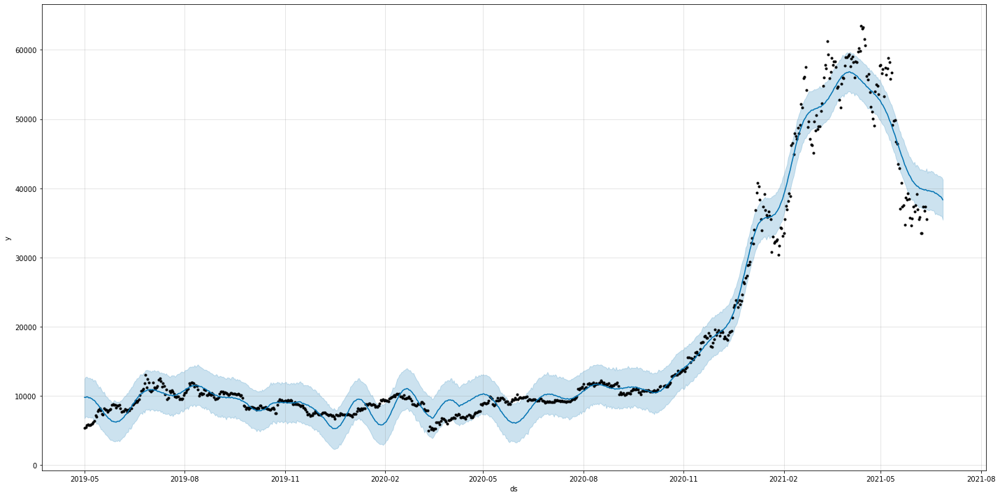
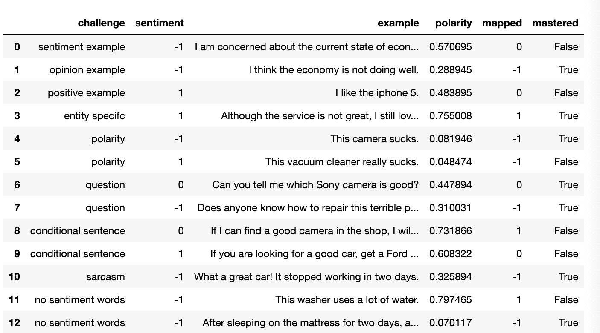
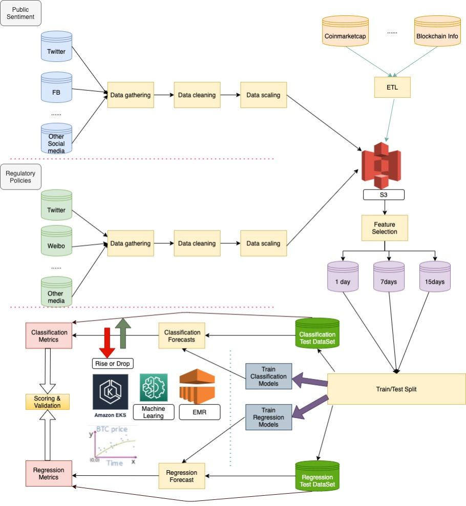

## 3. Trend Based On AI
We want to forecast crypto coin prices with the help of machine learning and deep learning. To simplify our tasks, we pick BTC as our pilot then ETH. Our goal is to forecast the prices of top 10 crypto coins in future. We setup a theory of **Time-series forecasting Crypto Coin prices using Hybrid Machine Learning Techniques, Public Sentiment and Regulatory Policies**

### 3.1 Machine Leaning
When it comes to time-series forecasts, people always only use historical data on the variable to do forecasting.  The traditional time-series forecast models like Autoregressive Integrated Moving Average (ARIMA) are more appropriate for univariate and stationary time-series data. But BTC prices are highly volatile, non-linear and non-stationary. Due to its rapidly changing nature, we need to add new features combine traditional machine learning models to forecast BTC prices.
Our objective is to estimate the value of a target variable x in a future time point 𝑥̂ [𝑡+𝑠] = 𝑓(𝑥[𝑡],𝑥[𝑡−1],...,𝑥[𝑡−𝑛]),𝑠>0, s is the horizon for forecast. The first step, we would focus on short time forecast at the beginning, which means we take into consideration daily closing price forecast, and price increase/decrease forecasting for the short term (end-of-day and next day) as the horizon for forecast. Our long-term goal is to forecast 7 – 30 days.
As for machine learning algorithms, we use the following ML models for classification and regression:

- Fb prophet
- support vector machines (SVM)
- artificial neural network (ANN)
- stacked artificial neural network (SANN)
- long short-term memory (LSTM)

The classification is applied as follows: If the BTC daily closing price 𝑃𝐵𝑇𝐶[𝑡+1]−𝑃𝐵𝑇𝐶[𝑡]≥0 then 𝑦[𝑡]=+1, and if 𝑃𝐵𝑇𝐶[𝑡+1]−𝑃𝐵𝑇𝐶[𝑡]<0, then 𝑦[𝑡]=0, where y[t] is a target variable for categories of increasing and decreasing price. where y[t] is a target variable for categories of increasing and decreasing price. The regression models are used to predict BTC prices in a horizon of forecast for end-of-day and next day and will expend to 7 – 30 days for a long-term plan.
For this part, we could get data from Coinmarketcap, Blockchain Info, etc.

Here is picture shows a demo that use prophet to forecast BTC prices based on more than 1 year historical data.

### 3.2 Public Sentiment
On the other side, we also need to collect social data and public data about public sentiment. Different sentiment like "greed" or "fear" means different attitude toward to "buy" or "sell" BTC. Sentiment analysis (SA) is the system of extracting the polarity of individuals’ subjective opinions from plain normal language texts. Sentiment analysis includes characterizing opinions in text into categories like "positive" or "negative" or "neutral.

We need get public sentiment data from some hot platform about crypto coins:
- Twitter
- Facebook
- Reddit
- Google Trends
- Telegram
- Etc.

For all sentiment data, next step is to clear and clean it then extract useful information and fill into a unified template for sentiment analysis. 
Sentiment from a normal person is totally different from a public figure such as Elon Musk. The sentiment from big names could bring sharply increase/decrease for BTC prices. Obviously, it’s impossible for a normal person. So, we have a list of public big names and assign higher weight to their sentiment for the forecast.

As for this part, there is a very famous sentiment analysis challenges from "Liu (2015): Sentiment Analysis : Mining Opinions, Sentiments, and Emotions. Cambridge University Press" and we are trying to solve it via some models like Textblob, Naive Bayes, etc. The picture shows that we are trying to solve the challenges via Textblob. The model masters 7/13 (53.8%) of the sentiment analysis challenges which means that the method is an acceptable model and could be used in our system.

### 3.3 Regulatory Policies 
BTC prices is highly depend on regulatory policies, for instance Bitcoin’s drop on Biden’s proposed tax and Bitcoin price drop due to china bans crypto business. This part could take extremely impact to BTC prices and should be given higher weight even than public figures.
There are a lot of ways to get this kind of news. For the purpose of simplify data ingestion for this kind of data. We could get regulatory news from some official channels of some key countries from Twitter, Weibo and other social media.
We need follow the same process to clear, clean and extract useful information then fill into a template about regulatory policies. 
A key idea is that some regulatory policies could impact crypto coin prices for a long period of time even could turn bull market to bear market or vice versa. For the purpose of identify this kind of policies, we have a very important sub task that is to find out this kind of news and policies and analyze it by machine learning and feed the result back to BTC prices forecast.

### 3.4 Solution Design
We will build our whole forecast system based on AWS. AWS has some PaaS services like EMR, Machine Learning and EKS could help us to simplify our takas and achieve our goals. Here are some key points we want to show:
1. BTC coin prices and transaction data collection then run ETL and put it into S3 buckets.
2. Public Sentiment data collection then run ETL and put it into S3 buckets.
3. Regulatory Data ingestion then run ETL and feed into S3 buckets.
4. Split data set for train and test.
5. Train and verify classification models.
6. Train and verify regression models.
7. Use classification models to forecast price increase/decrease.
8. Use regression models to forecast price trend.
9. Put our research result into our community and join the games with our users.
The picture shows the detailed information of the solution.

### 3.5 References
1. A. Saxena and A. Sukumar, "Predicting bitcoin price using lstm And Compare its predictability with arima model," International Journal of Pure and Applied Mathematics, vol. 119, no. 17, 2018, pp. 2591- 2600.
2. Suhwan Ji, Jognmin Kim and Hyeonseung Im, "A Comparative Study of Bitcoin Price Prediction Using Deep Learning"， DOI:10.3390/math7100898
3. "Understanding LSTM Networks -- colah's blog," 27 August 2015. [Online]. Available: http://colah.github.io/posts/2015-08-Understanding-LSTMs/.
4. Chen Z, Li C, Sun W (2020) Bitcoin price prediction using machine learning: an approach to sample dimension engineering. J Comput Appl Math 365:112395
5. Hyndman RJ, Athanasopoulos G (2018) Forecasting: principles and practice, 2nd edn. OTexts, Melbourne, Australia. https://otexts.com/fpp2/. Accessed 2 July 2020
6. Liu (2015): Sentiment Analysis : Mining Opinions, Sentiments, and Emotions. Cambridge University Press