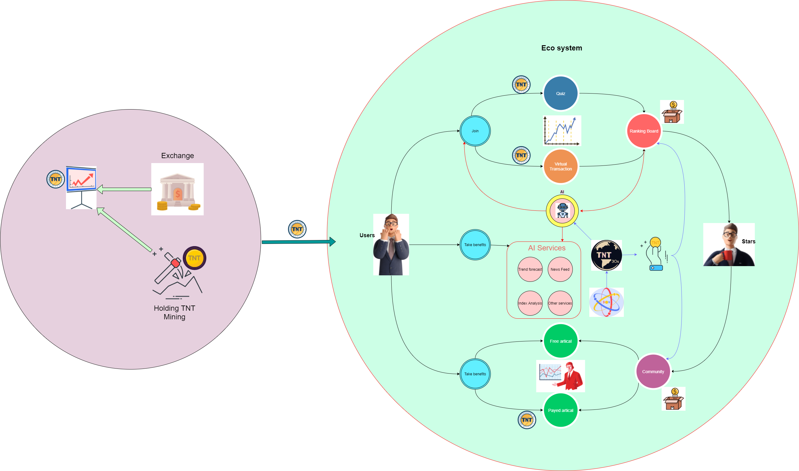
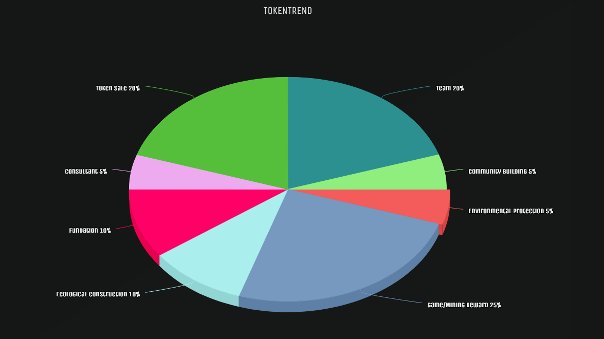

## 4. 生态

### 4.1 生态系统

我们的目标是建立一个如上图所示的生态系统。顾客从交易所买了代币，然后他就成了代币持有者。我们将免费为我们的TokenTrend持有者提供许多服务，他们唯一需要做的就是持有TokenTrend。我们可以把我们的生态系统大致分为三个部分。第一部分是**模拟交易系统**。第二个是**社区系统**, 最后一个是**人工智能系统**。这三部分也像上图所示一样相互关联。
#### 模拟交易系统
当他进入我们的生态系统后，他可以用他们的代币参加测验或虚拟交易。并且有一个根据结果的排名系统。通过排名系统，我们可以确定一些明星的硬币交易者和得到一些交易者的市场预期。确定的明星用户将被推送到**社区系统**，用户对于市场的期望将用于我们的**人工智能系统**。

#### 人工智能系统
AI系统将从互联网和**模拟系统**收集数据。经过数据分析，我们将提供至少3种服务**趋势预测**、**指数分析**、**新闻提要**。有关更多的技术说明，请参阅第3章了解更多详细信息。

#### 社区系统
所有的代币持有者都可以写有关代币交易的文章，但我们系统识别的明星用户将被冠以皇冠，以显示他的专业精神。文章可分为两类，一类是免费的，另一类是付费的。博客作者会从这部分中受益。

### 4.2 代币分配

所有代币将会被分配为以下用途.
- 代币销售 - 20%: 用于销售的代币。
- 咨询 - 5%: 用于咨询用途的花费。
- 基金 - 10%:
- 生态建设 - 10%: 用于构建整个社区
- 游戏等奖励 - 25%:
- 环保 - 5%:
- 社区建设 - 5%: 
- 开发团队 - 20%: 用于支付团队的薪水以及运营成本。
