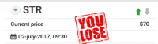

## 5. 业务场景以及设计

### 5.1 业务场景
我们有许多不同的方式在网上流通趋势币，除了在交易所流通，也可以在我们的网站上流通。我们组建了一个包含一个软件领域的首席开发和两个软件专家工程师领导的优秀和专业的IT开发团队，并由他们来开发一个的web平台。在这个平台上设计了多个激动人心的模块，为持有者提供了很多可以享受和趋势币流通的功能。

#### 场景1: 涨跌预测模块

我们将在这个模块中设置许多娱乐功能，比如真正加密货币趋势的测验。持有者可以使用他们的趋势币来享受这些功能带来的乐趣和好处。在这个模块中会有一个排名板显示谁是最好的玩家，因为我们得到的趋势是来自交换的真实数据，所以排名可以显示这些顶级玩家的真实水平，这使得他们在我们的社区模块中的分享和评论可以指导其他持有者了解真实加密货币的趋势。

我们保证在这个模块中绝对没有收费，这意味着当持有人享受这里，这是一个双赢的商业模式，没有任何额外的负担。

 

#### 场景2: 虚拟交易模块
加密货币世界中的大多数人通过应用程序检查货币的价格，通常是投币机、Blockfolio或类似的应用程序。虽然这些应用程序都不能提供准确的投资信息，但它们只允许跟踪市场状况或你的投资组合价值。

我们还知道，社区中几乎每个人（无论是加密交易员、矿工、小投资者还是资本大鳄）都会花费大量时间、经验，甚至运气，从博客、twitter、slack社区、troll Box和coinmarketcap.com等资源中查找投资提示和线索。

针对这些难点，我们设计了虚拟市场模块，在该模块中，持有人可以像在实际交易所一样操作加密货币，不同的是，将使用TokenTrend代替其他类型的加密货币。

通过这一激动人心的功能，持有人可以在这里练习和模拟这一交易，以验证他们对加密货币的判断，同时有机会赢得更多的趋势币。

在这个模块中会有一个相应的排行榜列表，显示赢得最多硬币的创业者，他们也可以在我们的社区模块中表达他们对趋势的看法，所有的持有者都可以从他们的想法中获益，因为我们网站上的几乎每个人都可以浏览所有公共分享，比如他们在Twitter上做的事情，不同的是，这个社区只是为货币圈建立的，每个人都有一个强大玩家的清晰面目，因为他们可以通过我们的虚拟市场排名板获取所有这些信息。

#### 场景3: 人工智能趋势预测模块
我们有强大的人工智能技术支持来实现趋势预测。我们的虚拟货币将作为本模块的流通货币。持有人可以得到人工智能生成的信息来指导他们的交易。

#### 场景4: 人工智能指数模块
我们将从媒体、社区和门户网站收集数据，通过语义分析提供情感指数。用户可以将此数据用作交换参考。我们将为趋势代币持有人免费提供该指数给客户。

#### 场景5: 人工智能信息推送模块
我们将收集最新的新闻，从网站上选择最重要的与我们的人工智能机器人，然后推给我们的客户。此服务仅免费提供给趋势币持有人。

#### 场景6: 线上社区模块

趋势币社区的主要使命是将志同道合的人们聚集在一起，在全球范围内相互支持和保护环境。持有人将加入社区，分享他们对加密货币和环境保护的看法。通过与竞猜模块和虚拟交易模块的互动，持卡人可以跟随这两个模块中的顶尖玩家，展示自己真正的职业水平，这对几乎每个人都会带来很多好处。

### 5.2 系统设计

我们设计了一个四层结构，以确保整个系统的高可靠性、稳定性和完整性，以及所有必要数据的高安全性。因此，我们为客户提供了一个高效可靠的平台。

1. 网络层：作为趋势令牌交叉链令牌的基本基础，我们将基于这些链聚合高质量的公共链和DEFI生态系统。这包括以太坊、Binance智能链和Huobi链，以提供跨链交易。

2. 可视化层：我们开发了多个可视化网站层，采用区块链最严格的认证方法，确保用户的安全。

3. 应用层：在组件前面放置2个负载均衡器集群，将网络流量和工作负载分布在2个计算集群上，提高了整个系统的可用性和容错性。我们构建了两个应用集群，进一步保证了系统的稳定性和吞吐量。

4. 数据层：我们使用数据库来存储必要的数据，这样所有的事务和其他活动数据都可以被跟踪和重用。采用Redis集群作为缓存层，ES集群提高了响应效率，提高了对数据库的保护。对于稳定的数据，我们将数据层和逻辑层隔离开来，以便于将来对Sol中的代码进行更新和维护。

 
